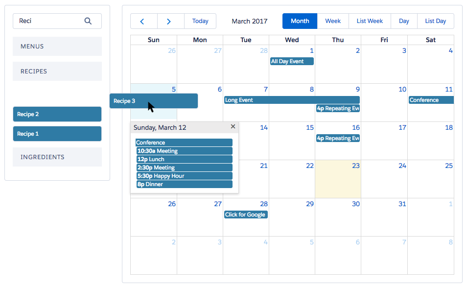

# Full Calendar lightning

Sample [Salesforce Lightning Components](https://developer.salesforce.com/docs/atlas.en-us.lightning.meta/lightning/) built with the [FullCalendar](https://fullcalendar.io/) jQuery library.

## Installation

- Enable shared activities in the target org (`Setup > Activity Settings > Allow Users to Relate Multiple Contacts to Tasks and Events`)
- Deploy the metadata from this repository
- Upload the data from this repository (optional)
